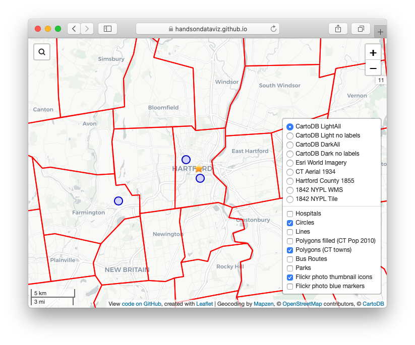

# leaflet-map
Leaflet map template to load local and remote files (GeoJSON, tileLayer, tileLayer.WMS) directly into legend toggle (L.control.layers) with simple jQuery calls.

<p align="center">
  
</p>

## Demo with Leaflet 1.x
 - https://handsondataviz.github.io/leaflet-map/

 ## Why this template?

This template illustrates simple and flexible methods for non-experts to create maps that require loading GeoJSON files and tileLayers from local directories and remote servers. The template features Connecticut, where I design maps with students and community partners at Trinity College, Hartford CT, and also with collaborators at MAGIC, the Map and Geographic Information Center at UConn Libraries, on projects such as https://OnTheLine.trincoll.edu and https://HandsOnDataViz.org.

 Learn more about Leaflet from these tutorials:
 - an excellent introduction by Maptime Boston: http://maptimeboston.github.io/leaflet-intro/
 - Leaflet Tutorials: http://leafletjs.com/examples.html

This template addresses my greatest challenge as novice coder: how to upload my own spatial data into Leaflet in the popular GeoJSON format, without getting lost in confusing jQuery functions. Leaflet's own intro tutorial skips over this important step. Other excellent tutorials show how to load GeoJSON data from inside a jQuery function, but in a way that does not easily allow you to place those layers in a toggle legend outside of that function. Finally, I discovered a simple, flexible solution posted by [@iH8 on StackOverflow]( http://stackoverflow.com/questions/28534705/how-to-add-two-geojson-feature-collections-in-to-two-layer-groups):
 ```
 // Create the layercontrol and add it to the map
var controlLayers = L.control.layers().addTo(map);

// Loading a GeoJSON file (using jQuery's $.getJSON)
$.getJSON('/my-folder/my-file.json', function (data) {

    // Use the data to create a GeoJSON layer and add it to the map
    var geojsonLayer = L.geoJson(data).addTo(map);

    // Add the geojson layer to the layercontrol
    controlLayers.addOverlay(geojsonLayer, 'My GeoJSON layer title');

});
```
See also working example by @iH8 on Plunker: http://plnkr.co/edit/tFVrrq?p=preview

Using this method, controlLayers is declared as a global variable near the top. When map layers are loaded in subsequent jQuery functions, they can be added directly to the map and/or to the legend toggle control. Overall, this approach seems more straightforward than other tutorials, yet I had not seen it described elsewhere. This template expands on the concept, inserts some sample layers and styling, and includes code comments for novices like me. Feedback and pull requests are welcome.

## To Do
- ADD credits and github links for all Leaflet plugins 
- FIX fluctuating order of overlay layers - related to when they load?
- TEST if placing overlay code closer to the end of init.js affects display order. For example, will starIcon always be on top if placed near the end? Or loaded after remote layers are loaded?
- improve polygon fillColor example
- rebuild file to display Pop Density, not just raw Pop2010
- change interaction from click to hover, and add legend to display colors and hover data (see US States leaflet tutorial example)
- rewrite first flickr blue marker example to search for first 100 photos near center of map
- rewrite Flickr popupHTML link to view original source photo directly on Flickr
- possibly include popupHTML function directly at bottom of relevant code section for more straightforward reading by code novices?
- test alternative flickr api call: https://www.flickr.com/services/api/explore/flickr.photosets.getPhotos
- This version has previously returned error: var flickrURL = "https://api.flickr.com/services/rest/?method=flickr.photosets.getPhotos&api_key=25dcc9a8c7410551dcb0af48c778bde5&photoset_id=72157646371103550&extras=geo%2Curl_t%2Curl_m&format=json&nojsoncallback=1";

## Credits
- Thanks to everyone who writes Leaflet tutorials for code novices like me
- Thanks @erose for teaching me Flickr JSON API and photo thumbnail icon code
- Thanks @iH8 for creative solutions to L.control.layers on StackOverflow: http://stackoverflow.com/questions/28534705/how-to-add-two-geojson-feature-collections-in-to-two-layer-groups and http://stackoverflow.com/questions/32262561/what-is-the-correct-method-to-toggle-markers-in-leaflet-map-control-layer
